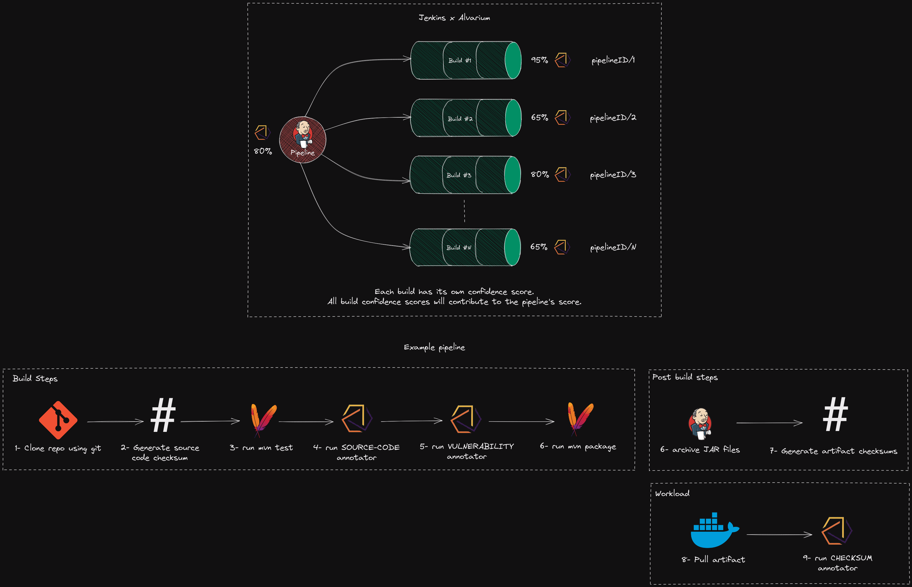
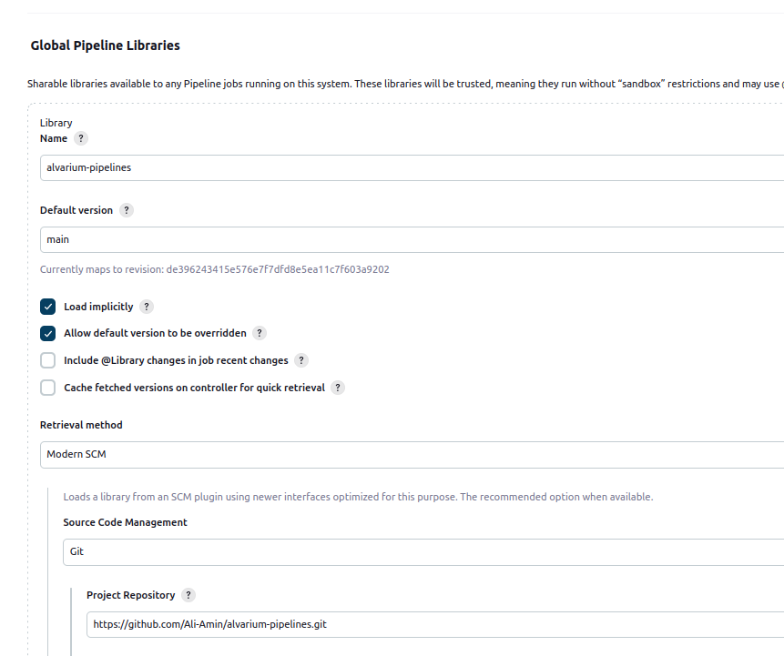

# Alvarium Pipelines Shared Library
This library is built using the [Alvarium Java SDK](https://github.com/project-alvarium/alvarium-sdk-java) and contains useful library functions to support capturing events during the execution of a Jenkins pipeline and publishing alvarium annotations designed for jenkins pipelines to provide confidence to the CI/CD process.



> For source-code and dependency vulnerability confidence, the relevant annotation keys become the value of the job name and the build number separated by "/" (e.g., "hello-world-pipeline/20")
>
> For the artifact checksum confidence, the annotation key becomes the artifact hash/checksum and lineage to the pipeline is established using the source annotator
>
> ℹ️ The methodology of which this pipeline is designed accordingly is that the first Alvarium SDK call is a `create()` method. And all subsequent calls are `transit()`. `mutate()` is called (usually with a 'checksum' annotator) when an artifact is being generated by the pipeline in order to capture the lineage of the artifact in terms of the build process, as well as generate a new vertex in the Alvarium Data Confidence Graph representing the artifact with an assigned confidence score. 

# Getting Started
## Alvarium Configuration
The [Config File Provider](https://plugins.jenkins.io/config-file-provider) plugin is used to provide configuration files to the alvarium SDK. After the plugin is installed, create a new configuration file from **Manage Jenkins > Managed Files > Add new config > Json file** and set the **ID** as `alvarium-config`. 

**Example configuration**

> Ensure that public and private keys are present at the paths provided in `signature.public.path` and `signature.private.path`. See https://github.com/project-alvarium/example-java/tree/main/src/main/resources for examples.

> ⚠️
> The library currently only supports "source-code", "checksum", and "vulnerability" annotators... Support for conventional alvarium annotators should be added soon.

```jsonc
{
  "annotators": [
    {
      "kind": "source-code"
    },
    {
      "kind": "checksum"
    },
    {
      "kind": "vulnerability",
      "type": "osv",
      "paths": {
        "queryBatch": "/v1/querybatch",
        "query": "/v1/query"
      },
      "provider": {
        "host": "api.osv.dev",
        "port": 443,
        "protocol": "https"
      }
    }
  ],
  "hash": {
    "type": "md5"
  },
  "signature": {
    "public": {
      "type": "ed25519",
      "path": "/home/public.key" 
    },
    "private": {
      "type": "ed25519",
      "path": "/home/private.key"
    }
  },
  "stream": {
    "type": "mqtt",
    "config": {
      "clientId": "alvarium-test",
      "qos": 0,
      "user": "",
      "password": "",
      "provider": {
        "host": "localhost",
        "protocol": "tcp",
        "port": 1883
      },
      "cleanness": false,
      "topics": ["alvarium-test-topic"]
    }
  }
}
```

## Adding to Jenkins
See the Jenkins docs on [Using Shared Libraries](https://www.jenkins.io/doc/book/pipeline/shared-libraries/) on how to add to the Jenkins instance. Testing was done by adding the library to the `${JENKINS_URL}/configure` 



Then by adding the following line on top of the Jenkinsfile
```groovy
@Library('alvarium-pipelines@main') _
```

## Usage

### **alvariumCreate(List<String> annotatorKinds, String artifactPath=null)**

Executes the passed annotators and instantiates an instance of the Alvairum Java SDK to publish them using the `Sdk.create()` method and sets the annotation key as the string `{pipelineID}/{buildNo}`

**`List<String> annotatorKinds`**: takes a list of annotator names identical to the format used in Alvarium configs that will be executed. The method will throw an error if there is no configuration entry for the annotator in the configuration file.

**`String artifactPath`**: Optional parameter that is only required when "checksum" annotator is passed in the `annotatorKinds` list and will throw an error if not present when required by the "checksum" annotator. This parameter is used to locate the artifact. The current implementation expects an existing artifact checksum at "\${JENKINS_HOME}/jobs/\${JOB_NAME}/\${BUILD_NUMBER}/\${artifactName}.checksum"

### **alvariumMutate(List<String> annotatorKinds, String artifactPath=null, byte[] newData)**
Executes the passed annotators and instantiates an instance of the Alvairum Java SDK to publish them using the `Sdk.mutate()` method and sets the source annotation (represents lineage) key as the string `{pipelineID}/{buildNo}` and the new data key using `byte[] newData`. This method is usually called after an artifact is created with annotators relating to artifact verification.

**`List<String> annotatorKinds`**: takes a list of annotator names identical to the format used in Alvarium configs that will be executed. The method will throw an error if there is no configuration entry for the annotator in the configuration file.

**`String artifactPath`**: Optional parameter that is only required when "checksum" annotator is passed in the `annotatorKinds` list and will throw an error if not present when required by the "checksum" annotator. This parameter is used to locate the artifact. The current implementation expects an existing artifact checksum at "\${JENKINS_HOME}/jobs/\${JOB_NAME}/\${BUILD_NUMBER}/\${artifactName}.checksum"

**`String newData`**: Used to define a new key for the annotations. This is usually a unique identifier for the artifact being produced by the pipeline (i.e., checksum or tag).

### **alvariumTransit(List<String> annotatorKinds, String artifactPath=null)**

Executes the passed annotators and instantiates an instance of the Alvairum Java SDK to publish them using the `Sdk.transit()`.

**`List<String> annotatorKinds`**: takes a list of annotator names identical to the format used in Alvarium configs that will be executed. The method will throw an error if there is no configuration entry for the annotator in the configuration file.

**`String artifactPath`**: Optional parameter that is only required when "checksum" annotator is passed in the `annotatorKinds` list and will throw an error if not present when required by the "checksum" annotator. This parameter is used to locate the artifact. The current implementation expects an existing artifact checksum at "\${JENKINS_HOME}/jobs/\${JOB_NAME}/\${BUILD_NUMBER}/\${artifactName}.checksum"

Here is an example Jenkinsfile that can be used to build the alvarium Java SDK

```Jenkinsfile
@Library('alvarium-pipelines@main') _

pipeline {
    agent any
    tools {
        maven 'M3'
    }
    stages {
        stage('prep - generate source code checksum') {
            steps {
                sh 'mkdir -p $JENKINS_HOME/jobs/$JOB_NAME/$BUILD_NUMBER/'
                sh '''find . -type f -exec md5sum {} + |\
                        md5sum |\
                        cut -d" " -f1 \
                        > $JENKINS_HOME/jobs/$JOB_NAME/$BUILD_NUMBER/sc_checksum
                '''
            }
        }

        stage('test') {
            steps {
                sh 'mvn test'
            }
            post {
                success {
                    junit 'target/surefire-reports/**/*.xml'
                }
            }
        }

        stage('alvarium - pre-build annotations') {
            steps {
                alvariumCreate(['source-code', 'vulnerability'])
            }
        }

        stage('build') {
            steps {
                sh 'mvn package'
            }
            post {
                success {
                    archiveArtifacts artifacts: 'target/**/*.jar', fingerprint: true

                    // Generate artifact checksums
                    sh ''' for f in target/*.jar;
                    do
                        mkdir -p $JENKINS_HOME/jobs/$JOB_NAME/$BUILD_NUMBER/
                        md5sum $f | cut -d ' ' -f 1 | tr 'a-z' 'A-Z' | tr -d '\n' \
                            > $JENKINS_HOME/jobs/$JOB_NAME/$BUILD_NUMBER/$(basename $f).checksum
                    done
                    '''

                    // Check if artifact has a valid checksum... Ideally this
                    // should be done by whatever is pulling the artifact but
                    // alvarium currently has no way of persisting information
                    // relating to annotator logic, which is why the checksum is
                    // being fetched from the file system instead of a persistent
                    // store
                    // TODO (Ali Amin): Find a way to persist the checksum
                    script {
                        def artifactChecksum = readFile "/${JENKINS_HOME}/jobs/${JOB_NAME}/${BUILD_NUMBER}/alvarium-sdk-1.0-SNAPSHOT.jar.checksum" 
                        alvariumMutate(['checksum'], '${WORKSPACE}/target/alvarium-sdk-1.0-SNAPSHOT.jar', artifactChecksum.bytes)
                    }   
                }
            }
        }
    }
}

```

